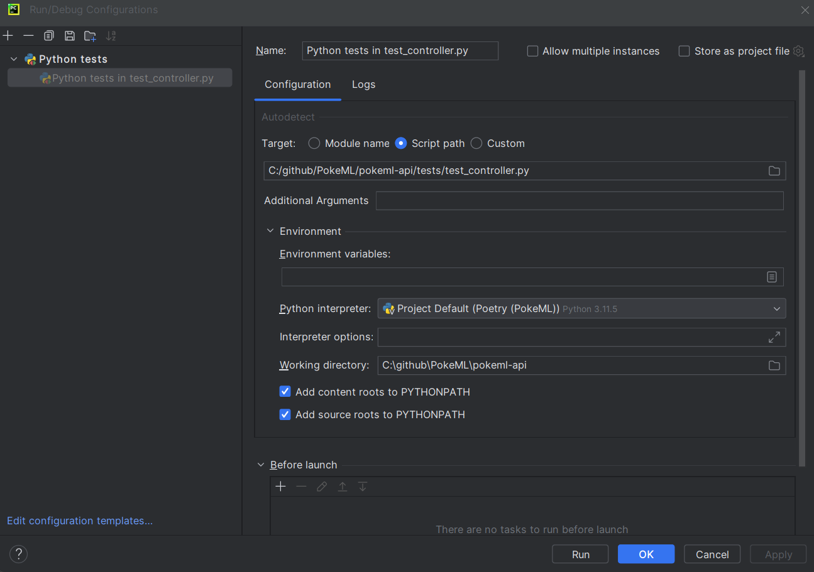

# PokeML
[](https://sonarcloud.io/summary/new_code?id=lilian-delouvy_PokeML)
[](https://sonarcloud.io/summary/new_code?id=lilian-delouvy_PokeML)

This project is a playground to implement a rotation ML model on Pokémon cards.

## Project architecture

The project will be separated in several parts :
- A single page application that will be used to provide cards, rotate them, and provide them to the backend
- A backend that will call the ML model and return the result the web application
- A web scrapping tool to recover Pokémon cards and train the ML model
- A python script to recover the Pokémon cards recovered via web scrapping and rotate them randomly to create our dataset

## API

The API uses Poetry for dependency management. Don't forget to install it and run ```poetry install``` before doing anything !

The following commands will be run inside poetry virtual environment, which can be activated with the ```poetry shell``` command.
To exit the virtual environment, you can just type ```exit```.

## Run the application

### Api and front

Start by going inside the "pokeml-front" folder and run ```npm install```, then ```npm run build-app```.

Then, inside the "pokeml-api/src" folder, you can run ```flask --app controller run```.

### Only the front

You can run ```npm install```, then ```npm run dev```.

##### Note

While it is technically possible to run only the api, it is not really useful as you will require the assets of the webapp if you want to see anything.
You can still call the "localhost:5000/health" route.

### Tests

#### Api
You can run the api unit tests by placing yourself in the "pokeml-api" directory and running ```python -m unittest discover tests```.

If you want to debug, here is a test setup example with PyCharm Community:

